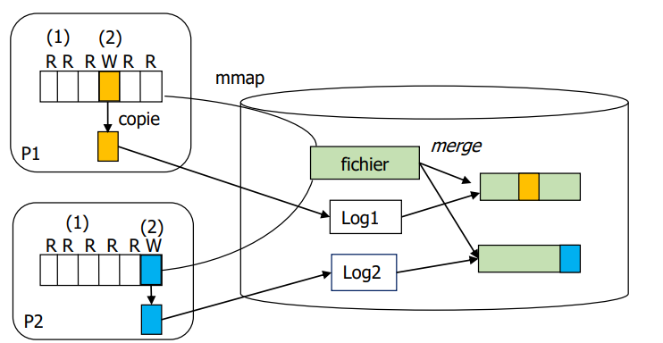
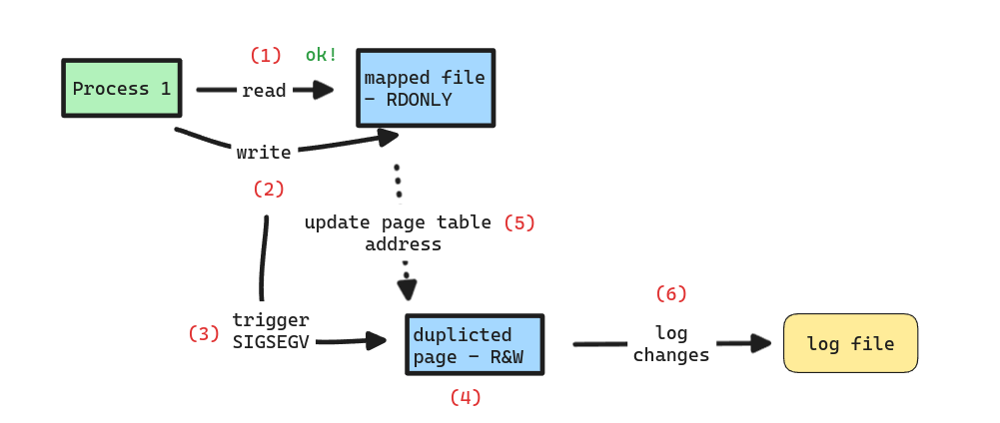
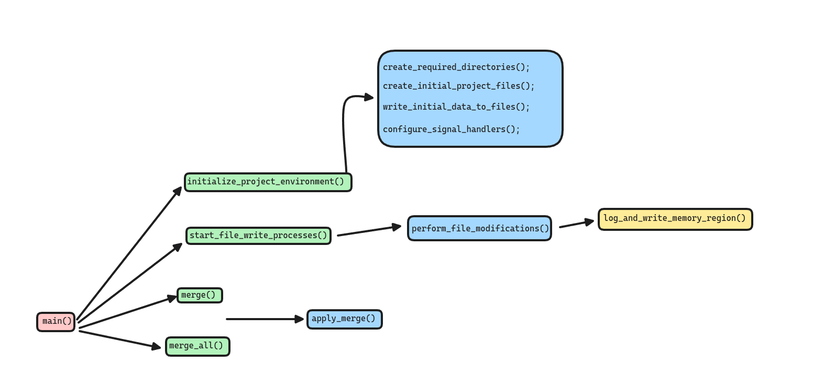

# Partage Cohérent de Fichiers Mappés en Mémoire

- [Partage Cohérent de Fichiers Mappés en Mémoire](#partage-cohérent-de-fichiers-mappés-en-mémoire)
  - [Contributors](#contributors)
  - [Mentor](#mentor)
  - [Introduction](#introduction)
    - [Memory Mapped File Example](#memory-mapped-file-example)
    - [I/O Operations](#io-operations)
    - [Goal of the Project](#goal-of-the-project)
  - [Proposed Solution](#proposed-solution)
  - [Project Setup and Structure](#project-setup-and-structure)
  - [Core functions and Their implementations](#core-functions-and-their-implementations)
    - [Execution Flow](#execution-flow)
  - [Compilation and Execution](#compilation-and-execution)
    - [Makefile](#makefile)
    - [Running the program](#running-the-program)
    - [Demo](#demo)
  - [Conclusion](#conclusion)
  - [Acknowledgments](#acknowledgments)
  - [Comparison of Memory-Mapped Files and Traditional I/O Operations](#comparison-of-memory-mapped-files-and-traditional-io-operations)
  - [Benefits of the Proposed Solution](#benefits-of-the-proposed-solution)


## Contributors

| name  | email | student number |
|---|---|---|
| Felipe Paris Mollo Christondis  | felipe.paris@etu.sorbonne-universite.fr  | 21305222  |
|  Victor Spehar |  vgdspehar@gmail.com  |  21309680 |

## Mentor
Pierre Sens - pierre.sens@lip6.fr

## Introduction
Memory mapping is a feature in operating systems that enables files stored on disk to be projected into virtual memory. This projection facilitates file manipulation by making its contents directly accessible as if they were in RAM, therefore accelerating both read and write operations through **direct memory address manipulation**.

### Memory Mapped File Example
 
Memory mapping uses the operating system's virtual memory system to establish a link between a file on disk and the process's address space. Once a file is mapped, any segment can be accessed as easily as **any memory array via pointers**. **Data from the actual file is loaded into memory on-demand through demand paging**, with only the accessed sections being loaded into RAM.

```c
// Example of mapping a file to memory
int fd = open("sample.txt", O_RDONLY);
struct stat fileInfo;
if (fstat(fd, &fileInfo) == -1) {
  perror("Error getting the file size");
}
char *mappedData = mmap(NULL, fileInfo.st_size, PROT_READ, MAP_PRIVATE, fd, 0);
```

### I/O Operations
Traditional I/O operations involve system calls that require transitioning from user space to kernel space, known as context switching. This can make randomly accessing various parts of a file less efficient, as each access may require disk seeking and potentially multiple disk reads and system calls.

```c
// Example of traditional file reading
int fd = open("sample.txt", O_RDONLY);
struct stat s;
if (fstat(fd, &s) == -1) {
  perror("Error getting the file size");
}
int fileSize = s.st_size;
char *buffer = malloc(fileSize + 1);
int bytes_read = read(fd, buffer, fileSize)
```

### Goal of the Project
The goal of this project is to improve the use of shared memory mapping. When multiple processes access a memory-mapped file, they can view and modify the same content. If these processes write to a file mapped with `MAP_SHARED`, their modifications are visible to all, leading to conflicts or inconsistencies. This project's goal is to enable each process to write to a shared memory without altering the common file, therefore preventing conflicts that could impact other processes also using that file.




## Proposed Solution
To address the challenge of concurrent modifications to a memory-mapped file without affecting the integrity of the original file, we propose implementing a copy-on-write mechanism.
1. **Shared Read-Only Access**: All processes initially share the same read-only view of the mapped file.
2. **Signal Handling for Write Attempts**: When a process attempts to modify the memory-mapped file, the system triggers a SIGSEGV signal. A pre-defined signal handler is activated in response to this signal.
3. **Memory Page Duplication**: The signal handler responds by duplicating the memory page that the process attempted to modify. Using the `mprotect` system call, the handler updates the page's permissions to allow both read and write operations.
4. **Updating Page Address**: The virtual memory mapping for the process is updated to point to the newly copied page. This is accomplished using the pteditor API, which allows direct manipulation of page table entries.
5. **Change Logging**: Instead of writing changes directly to the original file, each process records its changes in a dedicated log file. This method preserves the integrity of the original file while still allowing for modifications.
6. **Merging Changes**: Once processes have concluded their changes, a merge command consolidates the original file with the changes recorded in the log files. This results in an updated version of the file that integrates all modifications without risking data inconsistency.

This solution ensures data integrity and isolation between processes, allowing for efficient concurrent operations on shared files with minimal risk of conflicts.



## Project Setup and Structure
```bash
.
├── app
│   └── main.c
├── docs
│   └── rapport_final.md
├── files
├── include
│   ├── api.h
│   └── ptedit_header.h
├── logs
├── Makefile
├── merge
├── README.md
└── src
    └── api.c

7 directories, 7 files
```

* The `app/` directory hosts the main.c file, which serves as the entry point of the program. 
* Documentation including the final report and diagrams is within the `docs/` folder. 
* The `files/` directory is designated for storing files that processes interact with during execution. 
* Header files, including api.h and ptedit_header.h, are located in the `include/` folder, where you can find all interface definitions. 
* The `logs/` directory is used to store log files generated by the processes.
* The `merge/` directory contains the outputs of files when merged with logs.
* Source code implementations, particularly api.c that defines functions declared in api.h, are found in the `src/` folder.
* A Makefile is included at the root to facilitate easy compilation and setup, and the README.md provides an overview and instructions for the project.

## Core functions and Their implementations

```c
bool start_file_write_processes();
```
1. This function initializes signal handlers and the PTeditor API. 
2. It attempts to create a specified number of child processes (`NUMBER_OF_PROCESSES`). Each child is tasked with performing file modifications through the `perform_file_modifications` function. 
3. If a child process fails to start (i.e., fork returns a negative value), an error is logged, and the `all_success` flag is set to false. If the child starts successfully but fails during file modification, it logs an error and exits with `EXIT_FAILURE`. If any child process creation fails, the parent terminates all successfully started children and exits the loop early. 
4. If all child processes are created and complete their tasks successfully, the parent checks their exit statuses to ensure each child exited successfully. Any failure updates `all_success` to false. 
5. After managing the child processes, the function performs a cleanup using the ptedit_cleanup API and returns the `all_success` status.

```c
bool log_and_write_memory_region(char *mapped_region, off_t offset, const char *data, size_t len, size_t region_size, char * file_name);
```
1. The function starts by checking if the intended write operation goes beyond the bounds of the memory region mapped. This is done by checking if the sum of offset and len exceeds region_size. If the write operation exceeds the boundary, it logs an error message indicating this issue and returns false to signal the failure of the operation.
2. Constructs a log directory path using snprintf, which includes the process ID to ensure that log paths are unique to each process. The directory is named logs/logs_%d where %d is replaced by the process ID obtained from getpid().
3. Calls ensure_directory_exists with the log directory path. If this directory does not exist and cannot be created, the function returns false.
4. Extracts the base file name from the full path stored in file_name by searching for the last occurrence of the '/' character. If found, it moves past this character to point to the actual file name, otherwise, it uses the entire file_name string.
5. Retrieves the current time and formats it into a string timestamp using strftime, which is then used to create a uniquely timestamped log file name. Forms the complete path to the log file, incorporating the directory, the original file name, and the timestamp, resulting in a path like logs/logs_%d log_filename_timestamp.log.
6. Attempts to open the log file for writing, with flags set to create the file if it doesn’t exist and to append to it if it does (O_WRONLY | O_CREAT | O_APPEND). File permissions are set to 0666. If the file cannot be opened, it logs an error and returns false.
7. Writes the offset and length of the data to be written to the log file using dprintf, formatting the entry for clarity. Immediately after logging the details, writes the actual data to the log file using write. It also appends a newline character to ensure that each log entry is on a new line.
8. Closes the log file descriptor to release the file resource and ensure all data is flushed to the disk.
9. Copies the data to the memory region at the specified offset using memcpy. This step tries to modify the memory mapped region with the new data.

```c
bool merge(const char* original_file_path, const char* log_file_path);
```
1. The function attempts to open the original file in read-only mode (O_RDONLY). Similarly, the function tries to open the log file. 
2. Extracts the file names from the provided paths (stripping the directory path) using the strrchr function.
3. Constructs a new directory path under the merge directory using the name of the original file to ensure that all merge-related files are organized by the source file.
4. Forms the path for the merged file by concatenating the directory path and the original and log file names.
5. Reads the contents of the original file in chunks (of size 1024 bytes in this case). For each chunk read, it writes the chunk to the merged file.
6. Calls a function `apply_merge` that processes the log file to apply changes to the merged file. 
7. Closes all open file descriptors (for the original, log, and merged files) to free up system resources.

```c
bool perform_file_modifications();
```
1. Initializes an array of file descriptors (fd) for managing multiple files. Prepares a character array (file_name) to store each file's name.
2. Starts a loop from 0 to NUMBER_OF_FILES, intended to handle multiple files sequentially.
3. Constructs the file path using `snprintf`, creating a string in the format "files/file%d" where %d is replaced by the current file index. Opens each file in read-only mode (O_RDONLY). 
4. Retrieves file attributes using fstat, which populates a stat structure with details about the file, such as its size.
5. Maps the entire file into memory with read-only permissions (PROT_READ) and shared mapping (MAP_SHARED). This means changes to the mapped memory would not be reflected back to the file and is supposed to be read-only.
6. Calls log_and_write_memory_region, a function designed to log an attempt and perform a write operation on the read-only memory region. This function attempts to write a predefined string (WRITE_DEMO) at a predefined offset (WRITE_OFFSET) within the mapped memory. The attempt will raise a SIGSEGV signal because the memory region is read-only.
7. Unmaps the memory-mapped region using munmap, which frees up the allocated memory and detaches the mapped file from the process's address space. Closes the file descriptor using close.

```c
void signal_handler(int sig, siginfo_t * si, void * unused);
```
1. Retrieves the address where the segmentation fault occurred (si->si_addr) and aligns this address to the nearest page boundary using a function `align_to_page_boundary`. This ensures that the entire page containing the faulting address is handled.
2. Allocates a new memory page using mmap with both read and write permissions. This page is private and anonymous, meaning it is not backed by any file and is specific to the calling process.
3. Copies the contents of the page at the faulting address to this newly allocated page, therefore preserving the data that was in the faulting page before the fault occurred.
4. Sets the new page's memory protection to read and write using `mprotect`.
5. Retrieves the page table entries for both the faulting address and the new page using `ptedit_resolve`. This function is part of the ptedit library, which allows direct editing of page tables.
6. Identifies the specific page table entry in the page table that needs to be modified. It does this by mapping the physical frame of the page table to a virtual address (ptedit_pmap), then calculating the index within the page table for the faulting address.
7. Updates the PFN in the page table entry to point to the physical frame of the new page. This update is made using ptedit_set_pfn, which modifies the PFN in a page table entry.
8. Updates the page table entry for the faulting address to reflect the new mapping using ptedit_update. This changes the mapping so that future accesses to the faulting address will refer to the new page.
9. Invalidates the TLB entry for the faulting address using ptedit_invalidate_tlb to ensure that the processor does not use outdated translations.

```c
void apply_merge(int to_fd, int from_fd);
```
1. The function starts by setting the read position of the log file descriptor `(from_fd)` to the beginning of the file using `lseek(from_fd, 0, SEEK_SET)`. This ensures the changes are read from the start of the log.
2. The function enters a loop where it reads up to 1023 bytes from the log file into the log_line buffer. It leaves space for a null terminator to safely convert the buffer into a string.
3. After reading a chunk of data, the function null-terminates the buffer by setting `log_line[read_size] = '\0'`. It initializes a pointer ptr to the start of log_line and iterates through the buffer until it reaches the end of the read data.
4. Inside the loop, the function searches for newline characters (\n) using `strchr(ptr, '\n')` to identify individual log entries. If no newline is found (end_ptr is NULL), the loop breaks because it has reached the end of the current read buffer. It then sets the found newline character to a null terminator `(*end_ptr = '\0')`, isolating a single log entry as a string.
5. Each isolated log entry is expected to contain an **offset**, a **length**, and **data** in the format `Offset: %ld, Length: %zu, Data: %[^\n]`. The function uses `sscanf` to extract these values into local variables offset, len, and data. If the parsing is successful (i.e., sscanf returns 3), it proceeds to apply this change.
6. For each parsed log entry, the function sets the write position in the merged file descriptor (to_fd) to the specified offset using `lseek(to_fd, offset, SEEK_SET)`. It then writes the data to the merged file at the specified position using `write(to_fd, data, strlen(data))`. This overwrites or adds data at the specific position, updating the merged file based on the log entry.
7. After processing a log entry, the function updates the ptr to point to the start of the next log entry (ptr = end_ptr + 1) and continues processing until all log entries in the current read buffer are processed.

```c
bool merge_all(char * source_file_path);
```
1. The function begins by attempting to open the source file in read-only mode (O_RDONLY).
2. Retrieves the base name of the source file from the provided path by searching for the last '/' character. If not found, the entire path is used as the file name.
3. Constructs a path for the merged file where all changes will be applied. This is done using snprintf to append the base file name to a predefined directory and prefix, resulting in a path like merge/merge_all_%s.
4. Attempts to open or create the merged file in write mode (O_WRONLY), with flags to create the file if it doesn't exist (O_CREAT) and to truncate it if it does (O_TRUNC). Permissions are set to 0666.
5. Reads from the source file in chunks (1024 bytes at a time) and writes each chunk directly to the merged file. This process continues until all content from the source file has been copied.
6. Opens the directory logs where all log folders are located. If successful, the function then iterates through each entry in this directory.
7. For each directory entry, the function checks if it is a directory (ignoring '.' and '..'). It constructs the path to this subdirectory and opens it.
8. Within each log subdirectory, the function iterates through all entries. For each entry, it checks (using a function `is_log_file`) whether the file is a log file corresponding to the original source file. Constructs the path to each relevant log file and opens it in read-only mode. 
9. For each opened log file, the function calls `apply_merge`, passing the file descriptor of the merged file and the log file. This function will apply the changes recorded in the log file to the merged file. Closes each log file descriptor after processing.

### Execution Flow


## Compilation and Execution

### Makefile
```Makefile
# no prints to the terminal
.SILENT: 

CC=gcc # compiler
CFLAGS=-I./include # tells compiler to include the include folder during header file lookups

# Name of the executable
EXEC=psar

# Source files
SRC=$(wildcard src/*.c app/*.c)
OBJS=$(SRC:.c=.o)

# build target
all: $(EXEC)

$(EXEC): $(OBJS)
	@echo "Building $@"
	@$(CC) $(CFLAGS) $^ -o $@
	@echo "Build complete"
# clean project set up
clean: 
	@echo "Cleaning up"
	@rm -f $(OBJS) $(EXEC)
	@rm -f files/*
	@rm -rf logs/*
	@rm -rf merge/*
	@echo "Clean complete"

# in case if files were named like all or clean.
.PHONY: all clean
```

To build the project, run `make`. To remove compiled files and clean the project directory, run `make clean`. 

### Running the program
> *Attention: Do not forget to install the pteditor tool and to load the module to your kernel (`sudo modprobe pteditor`)*.

Once the project has been compiled, you will find the executable `psar` in the project directory.

* `./psar init`: Initializes the project environment.
* `./psar test`: Starts the file writing processes for testing. See variables `NUMBER_OF_FILES`, `NUMBER_OF_PROCESSES`, `DATA_DEMO`, `WRITE_DEMO` and `WRITE_OFFSET` in `api.h` for testing different scenarios. Once this commmand finishes, see the `logs/` folder for the results.
* `./psar merge -s [source_file] -l [log_file]`: Merges a source file with its corresponding log file. Once this commmand finishes, see the `merge/` folder for the results.
* `./psar merge_all -s [source_file]`: Merges all logs associated with a source file. Once this commmand finishes, see the `merge/` folder for the results.

### Demo

In the following example, we set up the project environment with `init`, creating the directories and files for testing. A file named `file0` is created with the content "`------------ Hello World! ------------`". The `test` command is run, which will start a process that attempts to write to the read only memory mapped file, triggering a segmentation fault which is handled with the mechanism explained [earlier in this document](#proposed-solution) (copy on write mechanism). A log file is then created with the changes, which will later be used by the `merge` command to generate an updated version of the file. 

```bash
paris@paris-pc:~/SAR/PSAR/PSAR$ lsmod | grep pteditor
pteditor               24576  0
paris@paris-pc:~/SAR/PSAR/PSAR$ make
Building psar
Build complete
paris@paris-pc:~/SAR/PSAR/PSAR$ ./psar
Usage: ./psar <command> [options]
Commands:
  init                     Initialize the project environment with necessary setup.
  test                     Start the file write processes for testing.
  merge -s [source_file] -l [log_file]  Merge changes from a log file into the specified source file.
  merge_all -s [source_file]  Apply all accumulated log modifications to the specified source file.
paris@paris-pc:~/SAR/PSAR/PSAR$ ./psar init
[Sun May  5 00:39:06 2024] [UPDATE] Folders log, merge and files created
[Sun May  5 00:39:06 2024] [UPDATE] 1 files were created
[Sun May  5 00:39:06 2024] [UPDATE] Data written to test files
[Sun May  5 00:39:06 2024] [UPDATE] SIGSEGV Signal Handler updated
paris@paris-pc:~/SAR/PSAR/PSAR$ ls files/
file0
paris@paris-pc:~/SAR/PSAR/PSAR$ cat files/file0
------------ Hello World! ------------
paris@paris-pc:~/SAR/PSAR/PSAR$ ./psar test
[Sun May  5 00:39:32 2024] [UPDATE] SIGSEGV Signal Handler updated
[Sun May  5 00:39:32 2024] [UPDATE] Process 14001 created
[Sun May  5 00:39:32 2024] [UPDATE] Process 14001 started reading and write routine
[Sun May  5 00:39:32 2024] [INFO] Handler caught SIGSEGV - write attempt by process 14001

[Sun May  5 00:39:32 2024] [UPDATE] Process 14001 updated virtual address 0x7f766dd51000 to new physical address 9223372041640208487
[Sun May  5 00:39:32 2024] [UPDATE] Process 14001 modified 1 files
paris@paris-pc:~/SAR/PSAR/PSAR$ ls logs/logs_14001/
log_file0_20240505_003932.log
paris@paris-pc:~/SAR/PSAR/PSAR$ cat logs/logs_14001/log_file0_20240505_003932.log 
Offset: 15, Length: 3, Data: xxx
paris@paris-pc:~/SAR/PSAR/PSAR$ ./psar merge -s files/file0 -l logs/logs_14001/log_file0_20240505_003932.log 
[Sun May  5 00:40:26 2024] [UPDATE] merge created for file file0
paris@paris-pc:~/SAR/PSAR/PSAR$ cat merge/merge_file0/file0_log_file0_20240505_003932.log 
------------ Hexxx World! ------------ 
```

## Conclusion
The project demonstrates how to handle concurrent file access through memory mapping by implementing a copy-on-write system. This approach ensures that the integrity of data is maintained across multiple processes, therefore solving the issue of data consistency in a shared memory environment.

## Acknowledgments
This project would not have been possible without the advice and expertise of Pierre Sans, who generously took the time to answer questions and resolve doubts about the best way to implement the project. Likewise, we are grateful to the creators of the PTEditor API (https://github.com/misc0110/PTEditor), who developed this tool that facilitated the manipulation of page table entries.


## Comparison of Memory-Mapped Files and Traditional I/O Operations

| Aspect                    | Memory-Mapped Files                                                                 | Traditional I/O Operations                                                |
|---------------------------|--------------------------------------------------------------------------------------|---------------------------------------------------------------------------|
| **Performance**           | Faster access by eliminating explicit read/write system calls; relies on OS paging  | Multiple system calls introduce overhead due to context switching         |
| **Convenience**           | Direct manipulation via memory operations (pointer dereferencing, array indexing)    | Requires explicit read/write calls and buffer management                  |
| **Memory Management**     | Managed by the OS's virtual memory manager, potentially more efficient                | Handled by the application, can be less efficient                         |
| **File Size & Address Space** | Limited by the process's addressable memory space (notable on 32-bit systems)     | Not limited by addressable memory, operates in chunks                     |


## Benefits of the Proposed Solution

| Benefit                    | Description                                                                                                    |
|----------------------------|----------------------------------------------------------------------------------------------------------------|
| **Consistent Read Access** | Multiple processes can map the same file and read its contents concurrently without issues, ensuring consistency. |
| **Isolated Writes**        | Using copy-on-write ensures write operations by one process do not affect other processes' views, preventing data corruption. |
| **Reduced I/O Overhead**   | Memory-mapped files allow direct access to file data in memory, eliminating explicit read/write system calls, reducing I/O overhead. |
| **Efficient Memory Usage** | Copy-on-write copies only modified pages, saving memory compared to copying the entire file for each process. |
| **Preservation of Original File** | The original file remains unchanged, ensuring data integrity, with modifications logged separately for auditing and rollback. |
| **Controlled Merging**     | Changes are only applied to the original file during explicit merge operations, allowing for controlled updates. |
| **Detailed Logs**          | Log files provide detailed information about modifications, aiding in debugging and error handling.            |
